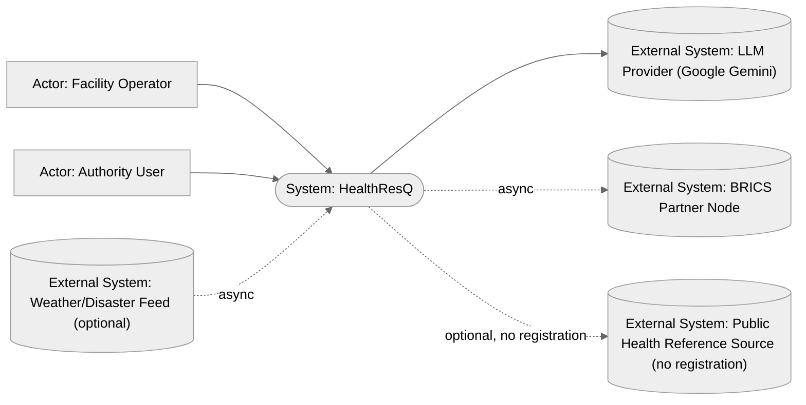
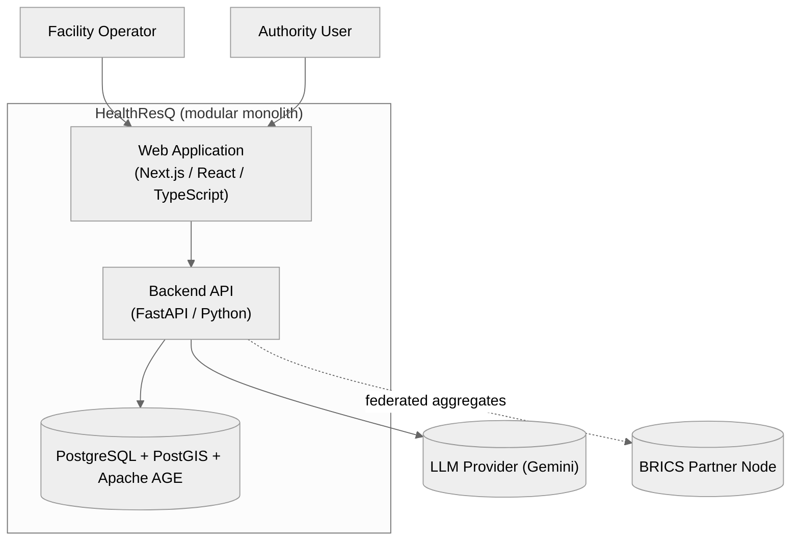
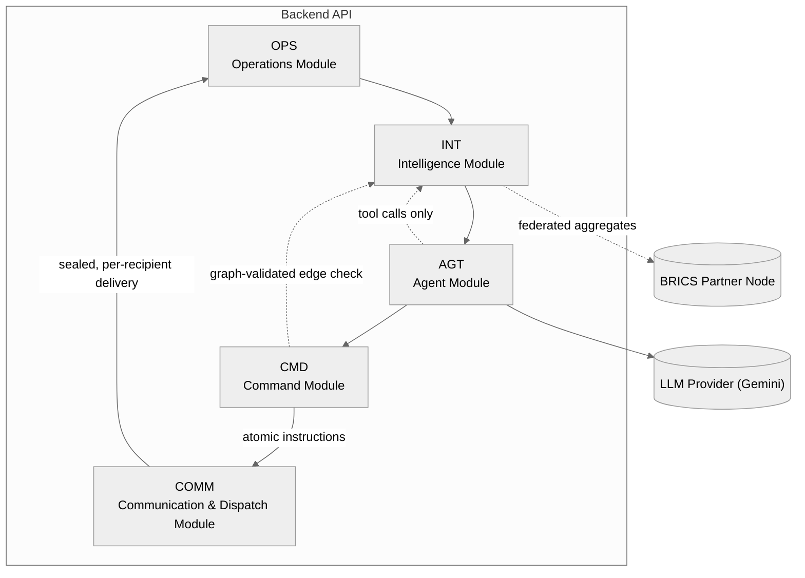
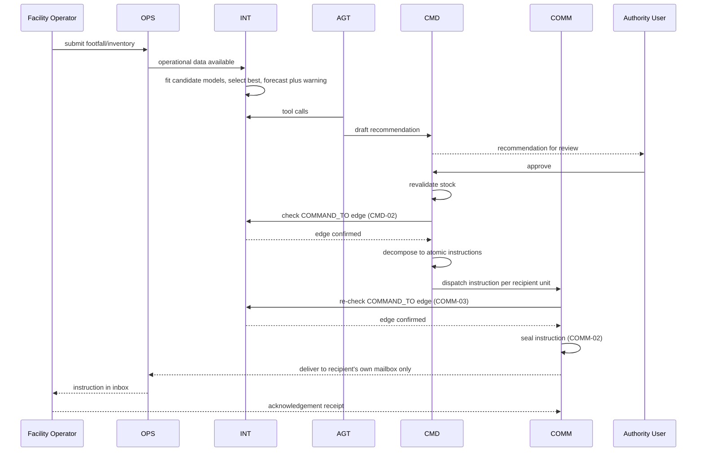
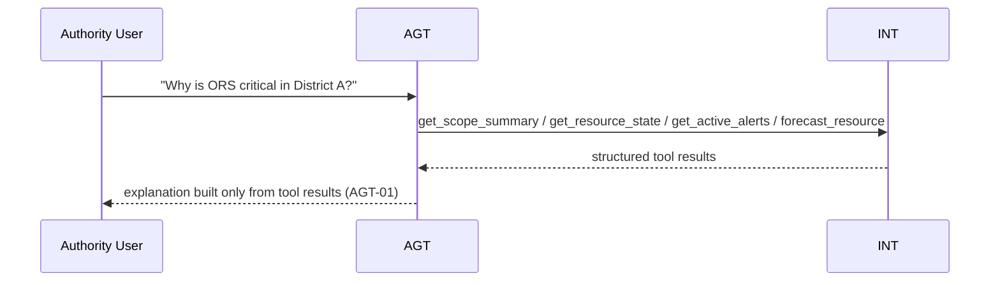
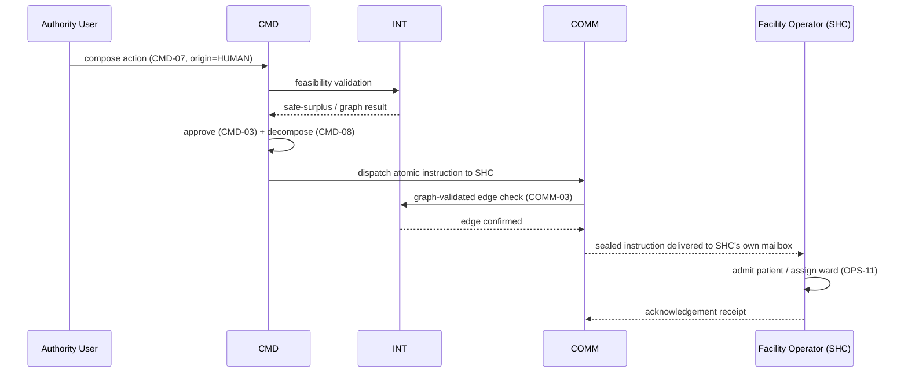

# HealthResQ — Architecture Document

## 0. Naming & Notation Registry [Core]

**Canonical names**

| Element | Canonical Name | Code | Type (Actor / Container / Component / External System) |
|---|---|---|---|
| PHC / warehouse / SHC staff who record operational data and execute instructions | Facility Operator | FAC | Actor |
| District / State / National officer who reviews and originates recommendations | Authority User | AUTH | Actor |
| Browser-based UI serving all facility and authority screens (no owned feature table — see note below) | Web Application | WEB | Container |
| FastAPI monolith holding all backend logic | Backend API | API | Container |
| Relational + persisted property-graph store of record | PostgreSQL + PostGIS + Apache AGE | DB | Container (Data Store) |
| Geography/auth, PHC/warehouse/SHC operations, hospital-management encounters, optional public reference lookup | Operations Module | OPS | Component (in API) |
| Advanced forecasting, early warning, anomaly detection, persisted supply/command graph, redistribution, federated analytics, visualization data | Intelligence Module | INT | Component (in API) |
| Tool-constrained LLM agent that investigates and drafts recommendations | Agent Module | AGT | Component (in API) |
| Recommendation lifecycle, authority routing, approvals, escalation, atomic-instruction dispatch, authority dashboards | Command Module | CMD | Component (in API) |
| Per-recipient sealed-mailbox, graph-validated instruction dispatch layer | Communication & Instruction Dispatch Module | COMM | Component (in API) |
| Google Gemini (tool/function-calling capable), called over its external API regardless of the self-hosted deployment | LLM Provider | LLM | External System |
| Peer national analytics node participating in federated aggregation | BRICS Partner Node | BRICS | External System |
| Optional external weather/disaster signal feed | Weather/Disaster Feed | WXF | External System |
| Public, zero-registration reference health-indicator source (WHO Global Health Observatory OData API — no API key, no sign-up) | Government/Public Health Reference Source | GOVT | External System |
| Offline/dev stand-in for GOVT, used only when no network path to it exists — not needed for access-permission reasons | Mock Government Health Reference Source | MOCKGOVT | External System |

**Note on WEB:** the Web Application is a real, single deployable container (Section 7) but does not own a Section 3 feature table. Every screen it renders is a feature of the backend domain component that owns the underlying capability (e.g. the PHC home screen is OPS-06, the district dashboard is CMD-09) — this avoids describing the same capability twice, once per container.

**Diagram legend** — reused on every diagram in this document:

| Symbol / Style | Meaning |
|---|---|
| Solid box | Container (independently deployable) |
| Dashed box | Component (internal to a container) |
| Solid arrow → | Synchronous call / dependency |
| Dashed arrow ⇢ | Async / event / message |
| Cylinder | Data store |

---

## 1. Overview & Objectives [Core]

**One-paragraph summary:** HealthResQ is a modular-monolithic health-resource and supply-chain resilience platform for Primary Health Centres (PHCs), Secondary Health Care (SHC) facilities, warehouses, and district/state/national health authorities. It aggregates live operational and hospital-management data, forecasts demand with advanced statistical/state-space models, detects stock-out risk, proposes redistribution across a persisted property graph, and routes every proposal through a human chain of command before anything is executed — decision-makers can act on system-suggested recommendations or originate their own. Approved actions are decomposed into atomic, per-recipient instructions and dispatched over a purpose-built, encrypted, graph-validated communication layer that structurally prevents one recipient's instruction from reaching, or being visible to, another. A tool-constrained LLM agent sits above the deterministic analytics as an investigator and explainer, never as the calculator or the decision-maker. For cross-country collaboration, only derived statistical aggregates — never raw facility data — are shared through a federated predictive-analytics layer.

**Problem statement:** Health authorities lack real-time, network-wide visibility into medicine stock, consumption, and facility capacity, which delays detection of stock-outs and slows redistribution across facilities, districts, states, and (for the BRICS challenge) partner countries — without requiring custom AI model training or a microservices build that a two-day prototype cannot sustain, and without a communication layer that risks one unit's instruction leaking into another's channel.

**Objectives:**
1. Capture and aggregate live operational state (medicine stock/consumption, patient footfall, bed availability, staff attendance, selected equipment status, warehouse inventory, transfers, and instruction execution status) from every PHC, SHC, and warehouse.
2. Forecast resource consumption using advanced statistical and state-space models (not deep learning, not custom-trained), auto-selected per series by cross-validated accuracy rather than a single fixed method.
3. Generate stock-out warnings by comparing projected stock (`current_stock + expected_incoming − forecast_consumption`) against configurable safety thresholds, at Normal/Watch/High/Critical severity.
4. Generate feasible redistribution recommendations (deficit facility, quantity, safe donors, route, donor-safety check) using a persisted property graph stored in the primary database, not an in-memory reconstruction.
5. Enforce hierarchical human command: every suggestion is routed to the lowest authorized authority for Approve/Modify/Reject/Escalate before it becomes an operational instruction; the system never moves resources autonomously; authority users may also originate actions directly.
6. Share only derived statistical aggregates (trend, seasonality, consumption per 1,000 visits, forecast error, volatility, stock-out frequency, lead-time distribution, surge multiplier) across BRICS national nodes — zero raw PHC records leave a node.
7. Constrain the LLM agent to investigation, explanation, and recommendation-drafting; it must never calculate forecasts, balances, graph paths, or approvals, and it cannot write to the database or execute a transfer directly.
8. Ship as a single modular monolith with a minimal set of consolidated domain modules: one backend application, one primary database (relational + graph), one frontend application, one authentication system, one deployment unit — merge modules that own adjacent domains rather than proliferate components.
9. Provide small-scale hospital management for PHC and SHC facilities — admission/ward/discharge and referral tracking — without becoming a full EHR.
10. Let decision-makers at every authority level both act on system-suggested recommendations and originate their own action suggestions from their dashboard, under the same feasibility and authority rules either way.
11. Break every approved action down into atomic, per-recipient instructions and dispatch them over a purpose-built communication layer that encrypts every instruction end-to-end and makes it structurally impossible for one recipient's instruction to be delivered into, or read from, another recipient's path.

**Non-goals / Out of scope:**
- A generic ontology or knowledge-graph platform — the persisted property graph (Apache AGE, an extension of the primary database) is a purpose-built supply/command graph, not a semantic knowledge platform.
- Digital twin simulation.
- Any custom-trained AI model, custom LLM, fine-tuning pipeline, or deep-learning forecasting — the advanced forecasting models (Section 3, INT-01) are classical/statistical and state-space models fit per series at request time, not trained neural models.
- Autonomous clinical AI or treatment recommendations; a full electronic health record (EHR) — the Operations Module's hospital-management features (OPS-10–14) cover only administrative/operational encounter tracking (admission, ward, discharge, referral), never clinical documentation.
- A dedicated message-broker deployment by default — COMM's sealed-mailbox model runs in-monolith for the prototype (COMM-01–03); a dedicated broker is an explicit, optional future upgrade (COMM-04), not the default build.
- A dedicated graph-database service by default — the persisted graph lives inside the primary PostgreSQL instance via Apache AGE; a standalone, self-hosted graph database (Memgraph, chosen over Neo4j so the upgrade path has no cloud/managed-service dependency) is an explicit, optional, config-selected upgrade (INT-14), not the default build.
- Complex scenario-planning engine.
- Microservices, Kubernetes, Kafka, or event sourcing.
- Long-term agent memory beyond the current session/scope/recent tool results.
- Autonomous resource dispatch or sophisticated vehicle routing (the greedy allocator, with an optional OR-Tools min-cost-flow upgrade, is sufficient for the prototype).
- Real federated model training across BRICS nodes (only federated *predictive analytics* — shared aggregates — is implemented; full federated training is a stated future-extensibility path, not claimed as built).

---

## 2. Stakeholders & Users [Extended]

| Role | Who | Expectation of the architecture |
|---|---|---|
| Facility Operator | PHC, SHC, and warehouse staff | Fast, low-friction data entry and a clear instruction inbox that only ever shows instructions meant for their own facility |
| Authority User | District / State / National health officers | A single screen to see risk, understand *why* (evidence-backed), approve/modify/reject/escalate, or originate their own action |
| BRICS Partner Node operator | Peer national health-analytics team | Receives and contributes only derived aggregates, never raw PHC-level records |
| Hackathon judges / evaluators | Competition reviewers | A continuous, demonstrable loop from live operations to a federated analytics screen, with nothing overclaimed |

---

## 3. Features [Core]

### Features — `Operations Module` (`OPS`)

| ID | Feature | Description | Priority (MoSCoW) | Requirement (EARS) | Acceptance Criteria |
|---|---|---|---|---|---|
| OPS-01 | Geography & authority hierarchy | Country → State → District → Facility hierarchy backing every scope check, dashboard rollup, and graph-node identity (Section 3, INT-06). | Must | The system shall resolve every facility to exactly one Country/State/District chain. | Every facility record has a non-null path to a single country; authority scope queries never return cross-branch data. |
| OPS-02 | Role-based auth & scoping | Single authentication system; users are scoped to a facility, district, state, or national level. | Must | The system shall restrict every read/write to the caller's authorized scope. | A District-scoped user cannot read or write another district's PHC data; verified by an authorization test per role. |
| OPS-03 | PHC/SHC patient footfall capture | Record OPD visits, admissions, discharges, referrals, and optional syndrome/category counts by date and shift. | Must | When a facility operator submits a footfall entry, the system shall store it against that facility and date/shift. | A submitted footfall entry is retrievable by facility, date, and shift within the same request cycle. |
| OPS-04 | Transactional inventory ledger | Track stock via opening stock + receipts − issues − transfers-out + transfers-in, never by overwriting a balance. | Must | The system shall compute current stock only from the sum of recorded inventory transactions. | Current stock for any product always equals the running total of its transaction history; a direct balance overwrite is not possible through the API. |
| OPS-05 | Bed, staff, and equipment status | Track total/occupied/available/unavailable beds; scheduled/present/absent staff by role and shift; status (AVAILABLE/IN_USE/UNAVAILABLE/MAINTENANCE) for selected equipment (oxygen concentrator, ambulance, cold-chain, diagnostic). | Must | The system shall record bed, staff-attendance, and equipment-status updates against a facility and timestamp. | Each of the three record types is queryable per facility for the current day. |
| OPS-06 | PHC/SHC home screen & instruction inbox | Single operational view of today's footfall/beds/staff/low-stock plus pending instructions, delivered exclusively through this facility's own COMM mailbox (Section 3, COMM-01); operator can acknowledge, mark ready/dispatched, or report a blocker but cannot alter the authority's decision. | Must | When an instruction is dispatched to a facility, the system shall present it in that facility's own inbox with priority and deadline, sourced only from that facility's mailbox. | A facility operator can move an instruction through ACKNOWLEDGED → READY → DISPATCHED (or report a blocker); the inbox never displays an instruction addressed to a different facility. |
| OPS-07 | Warehouse terminal | View stock, receive replenishment, receive dispatch instructions, prepare stock, dispatch, and confirm completion, via the warehouse's own COMM mailbox. | Must | When a dispatch instruction is issued to a warehouse, the system shall track it through ACKNOWLEDGE → PREPARE → DISPATCH. | Warehouse stock decrements only on a DISPATCH status transition tied to an instruction addressed to that warehouse. |
| OPS-08 | Data freshness classification | Every operational record carries `observed_at`, `updated_at`, and `source_facility_id`; freshness is classified LIVE (<1h) / RECENT (<6h) / STALE (<24h) / UNRELIABLE (≥24h). | Should | The system shall classify every operational record's freshness at read time using its `observed_at` age. | A record older than 24 hours is labeled UNRELIABLE in every screen and API response that surfaces it. |
| OPS-09 | Operations API surface | Expose facility data-entry, instruction-status, and warehouse endpoints consumed by the Web Application. | Must | The system shall expose REST endpoints for patient-activity, inventory-transaction, bed/staff/equipment updates, instruction status, and warehouse operations. | Every OPS screen in the Web Application is backed by a documented endpoint listed in Section 7. |
| OPS-10 | SHC/PHC facility-type support | Facility hierarchy includes Secondary Health Care (SHC) as a distinct type alongside PHC and Warehouse, both mandatory for the prototype; Referral Hospital is supported as an optional, reference-only facility type (can be created and linked, but no prototype workflow requires it) so SHC receives PHC referrals and runs a wider service catalog. | Must | The system shall support SHC as a distinct, mandatory-for-prototype facility type with its own scope and hierarchy position, and Referral Hospital as an optional type with no mandatory workflow attached. | An SHC facility can be created under a district, referenced by PHC referral-out records, and scoped exactly like a PHC in OPS-02 access checks; the prototype build and demo do not depend on any Referral Hospital record existing. |
| OPS-11 | Admission, ward & discharge tracking | Small-scale hospital-management record for SHC (and PHCs that admit patients): admit to a ward/bed, track status, and discharge — administrative/operational tracking only, not a clinical record. | Must | When a facility admits a patient, the system shall create an admission record linked to a ward and bed, and close it on discharge. | An open admission always references exactly one occupied bed in OPS-05; discharging it releases that bed in the same transaction. |
| OPS-12 | Lightweight OT/procedure scheduling | Basic scheduling of operation theatre/procedure slots at SHC level: default 30-minute slot granularity, no hard cap on slot count (bounded in practice by each SHC's configured number of OTs), sufficient to reflect capacity pressure upward without becoming a full theatre-management system. | Could | The system shall record a scheduled procedure's facility, ward, time slot (default 30-minute granularity), and status (SCHEDULED/IN_PROGRESS/COMPLETED/CANCELLED). | Two procedures cannot be scheduled in the same OT slot at the same facility; slot granularity is a configuration value defaulting to 30 minutes. |
| OPS-13 | Referral in/out between PHC and SHC | Record a referral from a PHC to an SHC (or between SHCs) with reason, urgency, and receiving-facility acknowledgement, distinct from a resource-redistribution recommendation. | Must | When a PHC creates a referral to an SHC, the system shall notify the receiving facility and track the referral's status until acknowledged or closed. | A referral has exactly one source facility, one destination facility, and one of OPEN/ACKNOWLEDGED/CLOSED status at any time. |
| OPS-14 | Public reference-indicator adapter | Optional adapter to a genuinely public, no-registration data source — the WHO Global Health Observatory OData API (`ghoapi.azureedge.net`/`data.who.int`), which requires no API key or account — used to pull national baseline indicators that INT-12's cold-start fallback can use alongside the BRICS reference profile. Defaults to health-workforce-density indicators (e.g. skilled health professionals, medical doctors, and nursing/midwifery personnel per 10,000 population) as the initial reference set, since they scale sensibly to a facility's likely patient load; the adapter resolves each indicator's current `IndicatorCode` via GHO's own indicator-dimension lookup at startup rather than hard-coding codes that could change. Refreshed weekly by default, since these are slow-moving national statistics. Falls back to a local mock behind the same interface only when there is no network path, never because of an access barrier. | Could | Where a network path to the public reference source exists, the system shall use it for reference-indicator lookups, refreshed on a default weekly schedule; otherwise the system shall use the mock adapter with an identical interface. | No registration, API key, or account is required anywhere in this adapter's real (non-mock) path; the indicator set and refresh interval are both configuration values, not hard-coded; switching adapters requires only a configuration change. |

### Features — `Intelligence Module` (`INT`)

| ID | Feature | Description | Priority (MoSCoW) | Requirement (EARS) | Acceptance Criteria |
|---|---|---|---|---|---|
| INT-01 | Advanced auto-selected demand forecast | For very short history (<7 observations), use a recent-average floor case. Otherwise, fit multiple candidate models per series — seasonal ARIMA (SARIMA), a Bayesian structural time-series / Kalman-filter local-level-trend-seasonal state-space model, and a decomposable additive (trend + seasonality + event-effect) model — and auto-select the candidate with the lowest rolling-origin cross-validated error (MASE), rather than a single fixed method chosen by history length alone. | Must | The system shall fit every eligible candidate forecasting model to a series' available history and select the one with the lowest cross-validated error. | For any history length above the floor-case threshold, the selected model is never worse, on held-out cross-validation folds, than any other eligible candidate for that series. |
| INT-02 | Footfall-adjusted consumption | Scale the base consumption forecast by a clamped ratio of recent 3-day footfall to 14-day baseline footfall. | Should | While recent footfall diverges from baseline, the system shall multiply the base forecast by a clamped footfall-adjustment ratio. | A facility with a footfall surge shows a proportionally higher adjusted forecast than its base forecast, bounded by the configured clamp. |
| INT-03 | Probabilistic forecast uncertainty | Where the selected INT-01 model is a Bayesian/state-space model, report its native posterior credible interval; otherwise derive a likely-demand range from recent forecast residuals (mean absolute error, standard deviation, quantiles). | Should | The system shall report a likely-demand range alongside every point forecast, using the selected model's native uncertainty where available and a residual-based range otherwise. | Every forecast response includes both a point estimate and a range, and the range's source (model-native vs residual-based) is recorded. |
| INT-04 | Stock-out projection & early warning | Compute `projected_stock(t) = current_stock + expected_incoming(t) − forecast_consumption(t)` per facility-resource pair and classify Normal / Watch (≤7 days) / High (≤3 days) / Critical (≤48h) against configurable safety thresholds. | Must | When projected stock for a facility-resource pair crosses a configured safety threshold, the system shall raise a warning at the corresponding severity. | A facility whose projected stock crosses the 48-hour threshold is flagged CRITICAL, and the same input never yields two different severities. |
| INT-05 | Statistical anomaly detection | Detect demand surges/drops using z-score, rolling deviation, percentage change, and baseline comparison against an STL-decomposed baseline — no ML model. | Should | When a resource's recent consumption deviates from its 14-day baseline beyond a configured percentage, the system shall flag an anomaly with the measured deviation. | An anomaly record includes the baseline value, the recent value, and the percentage change that triggered it. |
| INT-06 | Persisted supply & command graph | Store facilities/authority levels as nodes and SUPPLY_ROUTE / ADMIN_PARENT / CAN_TRANSFER_TO / ESCALATES_TO / COMMAND_TO relationships as edges natively in a property graph (Apache AGE, a PostgreSQL extension queried via openCypher) inside the primary database — not rebuilt in memory per query. COMMAND_TO edges are the authorization source COMM-03 checks before any instruction is dispatched. | Must | The system shall persist every graph node and edge as first-class rows in the database and answer graph queries directly against that store. | Updating a `facility_links`-equivalent graph edge is immediately visible to the next graph query with no separate rebuild or sync step. |
| INT-07 | Graph queries | Answer nearest-safe-donor, dependency-impact, alternative-supply-path, authority-routing, and cluster-risk queries over the persisted graph via openCypher. | Must | When a graph query is issued for a facility-resource pair, the system shall return ranked, reachable results using the current graph weights. | Each of the five documented query types returns a result set ordered by graph cost (distance + delay penalty + boundary penalty). |
| INT-08 | Redistribution search | For a facility with a deficit, query the persisted graph for reachable candidates, exclude zero-surplus donors, sort by graph cost, allocate quantity, recalculate donor safety, and repeat until the deficit is resolved or candidates are exhausted. | Must | When a facility-resource deficit exists, the system shall generate a redistribution plan of source→destination movements that does not reduce any donor below its own safety stock. | No generated movement leaves a donor's post-transfer stock below its computed safe surplus. |
| INT-09 | Minimum-cost-flow upgrade path | Allow the same resource network to be solved with OR-Tools' minimum-cost-flow solver in place of the greedy allocator, without changing any other module. | Could | Where the min-cost-flow solver is enabled, the system shall use it in place of the greedy allocator for redistribution search. | Swapping allocators changes only the INT-08 implementation; no other module's interface changes. |
| INT-10 | Federated predictive analytics | Compute local statistical parameters per national node (weekly/monthly seasonal index, demand trend, consumption per 1,000 visits, volatility, lead-time mean/variance, forecast MAE/bias, stock-out frequency, surge multiplier) and share only these derived aggregates. | Must | The system shall exclude all PHC-level and patient-level fields from any payload sent to the federation aggregator. | A federation payload for a country contains only the eleven documented aggregate fields; zero raw rows are present. |
| INT-11 | Federation aggregator, reference profile & screen | Combine national statistics via sample-weighted averaging (`Σ(metric×samples)/Σ(samples)`, with robust median/trimmed mean for unstable metrics) into a shared BRICS reference profile, and display participant count, latest round, raw-records-shared (always 0), per-resource global metrics, and a country comparison table. | Must | When national aggregates are submitted, the system shall recompute the shared reference profile using sample-weighted aggregation, and the displayed raw-records-shared figure shall always read 0. | The published reference profile updates after each federation round and is reproducible from the submitted per-country aggregates; the federation screen never renders a non-zero raw-records-shared value. |
| INT-12 | Cold-start & surge fallback | For a facility with insufficient local history, fall back through district → state → national → BRICS reference profiles (and OPS-14's public reference indicators where relevant), scaled by current footfall; for an observed local surge, compare it against the federation's historical surge-multiplier range. | Should | If a facility has insufficient local history for INT-01, then the system shall substitute the nearest available reference profile in the district→state→national→BRICS fallback order. | A facility with under the INT-01 minimum-history threshold receives a forecast sourced from a fallback profile, and the chosen profile level is recorded on the forecast. |
| INT-13 | Risk & supply visualization data | Serve the data behind the risk map (color-coded facility markers by INT-04 severity with a facility detail popup), the resource explorer (per-resource stock/forecast/deficit rollup), and a lightweight graph view scoped to only the facilities/edges relevant to the active recommendation. | Should | The system shall scope the graph-view response to only the nodes and edges referenced by the active recommendation's INT-07/INT-08 result. | A facility's map-marker color always matches its current INT-04 severity; the graph view never includes a facility that isn't a source or destination in the active recommendation. |
| INT-14 | Dedicated graph-database upgrade path | Documented, optional production upgrade: point the same openCypher queries at a standalone graph database (e.g. Neo4j) instead of the in-database Apache AGE store, triggered when the graph exceeds roughly 50,000 facility-equivalent nodes (i.e. genuine multi-country national scale, beyond a single-country prototype) or when p95 graph-query latency exceeds 200ms sustained, whichever comes first — without changing INT-07/INT-08/COMM-03's interfaces. | Could | Where the dedicated graph-database upgrade is enabled, the system shall route graph queries to it instead of Apache AGE through the same query interface. | Enabling the upgrade changes only INT-06's internal implementation; no INT-07, INT-08, or COMM-03 caller changes; the 50,000-node and 200ms thresholds are configuration values, not hard-coded triggers. |

### Features — `Agent Module` (`AGT`)

| ID | Feature | Description | Priority (MoSCoW) | Requirement (EARS) | Acceptance Criteria |
|---|---|---|---|---|---|
| AGT-01 | Tool-constrained agent controller | Route an authority's natural-language question through a scope/permission check, tool selection, structured tool execution, and Google Gemini's synthesis of the returned results only. Pinned to a Flash-tier Gemini model by default: the architecture deliberately keeps all calculation in deterministic tools (Section 3, AGT-05), so the LLM's job is synthesis and explanation of already-correct numbers, not deep reasoning — a fast/cost-efficient tier fits that role and keeps AGT-03's bounded multi-call loop responsive. A Pro-tier model is a configuration-only escalation for CMD-06's longer situation reports if a Flash-tier draft proves insufficient, with no interface change. | Must | The system shall answer every agent query using only values returned by its own tool calls, never a value computed by the LLM, using the configured Gemini model tier (Flash-tier by default). | Any number in an agent response can be traced to a specific tool-call result in the same interaction's log; switching model tiers is a configuration change, not a code change. |
| AGT-02 | Read, intelligence, and command-preparation tool set | Expose `get_scope_summary`, `get_facility_state`, `get_resource_state`, `get_warehouse_state`, `get_active_alerts`, `get_instructions` (read); `forecast_resource`, `get_stockout_risk`, `get_anomalies`, `find_safe_donors`, `get_dependency_impact`, `generate_redistribution_options` (intelligence); and `draft_recommendation`, `draft_escalation`, `draft_instruction`, `generate_situation_report` (command-preparation, draft-only) as agent tools. | Must | The system shall expose INT and CMD capabilities to the agent only through the documented tool contracts. | The agent has no code path to OPS/INT/CMD other than the listed tool functions. |
| AGT-03 | Bounded investigation loop | Allow the agent to chain inspect-scope → find-anomaly → request-forecast → inspect-graph → generate-redistribution-options → explain, up to a maximum of 8 tool calls per interaction (configurable). | Must | If the agent's tool-call count in one interaction reaches the configured maximum (default 8), then the system shall stop the loop and return the best available answer. | No single agent interaction issues more than 8 tool calls by default; the cap is a configuration value, not a hard-coded constant. |
| AGT-04 | Proactive agent triggers | Trigger the agent automatically on a CRITICAL warning, a cross-district deficit, a blocked instruction, warehouse unavailability, or a required escalation, producing a draft recommendation plus explanation without sending anything. | Should | When a CRITICAL warning, cross-district deficit, blocked instruction, warehouse unavailability, or required escalation is detected, the system shall generate a draft recommendation via AGT-01/CMD-01. | Each of the five trigger conditions produces exactly one new DRAFT recommendation, never an auto-approved one. |
| AGT-05 | Agent safety rules | Enforce: no clinical diagnosis or treatment advice; no direct database writes; no autonomous approvals; no fabricated quantities; no transfer without algorithmic (INT) validation; no access beyond role scope; every proposed action is structured and reviewable with source evidence; a tool error forces abstention rather than a guessed answer. | Must | If a required tool call fails, then the system shall have the agent abstain from answering that part of the query rather than substitute an estimate. | A simulated tool failure results in an explicit "unable to determine" response, never a fabricated number. |

### Features — `Command Module` (`CMD`)

| ID | Feature | Description | Priority (MoSCoW) | Requirement (EARS) | Acceptance Criteria |
|---|---|---|---|---|---|
| CMD-01 | Recommendation object & lifecycle | Persist recommendations with scope, resource, problem, evidence, forecast/graph references, suggested movements, required authority, origin (AGENT/HUMAN), and agent explanation, moving through DRAFT → PENDING_REVIEW → APPROVED/MODIFIED/REJECTED/ESCALATED → EXECUTING → COMPLETED. | Must | The system shall record every recommendation state transition with a timestamp and the acting user. | A recommendation's full state history is reconstructable from stored transitions alone. |
| CMD-02 | Graph-validated authority routing | Resolve required approval authority and legitimate instruction path by querying INT-06's persisted graph for the relevant ADMIN_PARENT/COMMAND_TO edge (same-district PHC→PHC = District; cross-district = State; cross-state = National); the agent explains this result but never decides it, and COMM-03 re-checks the same edge before dispatch. | Must | The system shall compute the required authority and instruction path using only graph-persisted administrative edges, independent of any agent output. | For a fixed source/destination pair, the computed required authority and path are identical regardless of which user or agent session requested it. |
| CMD-03 | Human decision screen & approval transaction | Present problem, deficit, proposed movements, projected result, and evidence with Reject/Modify/Escalate/Approve actions; disable Approve whenever CMD-04 marks the recommendation OUTDATED; on approval, run one transaction that verifies authority, locks/rechecks stock, confirms feasibility, marks the recommendation approved, hands off to CMD-08 for atomic-instruction decomposition, and appends audit events. | Must | When an authority user approves a recommendation, the system shall execute the verify-authority, recheck-stock, decompose-to-instructions, and audit-append steps as a single atomic transaction. | An approval that fails feasibility recheck leaves the recommendation state unchanged and creates no partial atomic instructions; an OUTDATED recommendation cannot be approved from this screen. |
| CMD-04 | Revalidation before approval | Rerun safe-surplus validation immediately before committing an approval; if stock changed since generation, mark the recommendation OUTDATED and require recalculation instead of executing against stale numbers. | Must | If the safe-surplus revalidation fails at approval time, then the system shall mark the recommendation OUTDATED and block the approval transaction. | A recommendation whose supporting stock changed after generation cannot be approved without first being recalculated. |
| CMD-05 | Escalation workflow | When the current authority cannot fully resolve a deficit, prepare an escalation package (problem, current deficit, forecast horizon, local sources checked, unresolved quantity, suggested higher-level sources) and route District → State → National along INT-06's ESCALATES_TO edges. | Should | When an authority escalates a recommendation with an unresolved deficit, the system shall generate an escalation package listing the sources already checked and the unresolved quantity. | An escalated recommendation's package always includes a non-zero unresolved-quantity field. |
| CMD-06 | Situation report generation | Produce a structured narrative situation report (e.g., PHCs at risk, coverage from local redistribution, remaining deficit, instructions executing) referencing only stored system results. | Could | The system shall generate a situation report using only values already present in INT/CMD records, with no agent-invented figures. | Every figure in a generated situation report matches a corresponding stored INT or CMD record. |
| CMD-07 | Authority-originated action suggestion | An Authority User can compose a recommendation directly from a dashboard control (not only react to an agent-drafted one), restricted to facilities/units in their own scope. It carries origin=HUMAN but otherwise follows the same CMD-01 lifecycle, including the AGT-05 rule that no transfer executes without INT feasibility validation, even when a human proposed it. | Must | When an Authority User submits a self-authored action, the system shall create a CMD-01 recommendation with origin=HUMAN, restrict its selectable recipients to the user's authorized scope, and run the same feasibility validation as an agent-drafted one before it can be approved. | A HUMAN-origin recommendation cannot be approved if INT feasibility validation fails, identically to an AGENT-origin one; a District user cannot target a facility outside their district when composing one. |
| CMD-08 | Atomic instruction decomposition & dispatch | On approval (CMD-03), break a recommendation's suggested movements into one atomic instruction per recipient unit (each PHC, SHC, warehouse, or branch named in the plan) and dispatch each to that unit's own COMM sealed mailbox (Section 3, COMM-01–03) after CMD-02's graph-validated authority check. An "instruction" is the same `atomic_instructions` row a facility sees as an inbox entry (OPS-06/07) — one object, one name. | Must | When a recommendation is approved, the system shall create exactly one atomic instruction per recipient unit named in its movements and dispatch each to that unit's own mailbox only after its COMMAND_TO edge is confirmed by CMD-02. | The count of atomic instructions created for an approved recommendation equals its number of distinct recipient units; each is independently trackable through ACKNOWLEDGED/IN_PROGRESS/COMPLETED/BLOCKED; no instruction is ever created without a confirmed edge. |
| CMD-09 | Tiered authority dashboards | District, State, and National dashboards: District shows alert counts by severity, a facility risk map, and district-level state; State rolls up district risk, cross-district deficits, and state-authority recommendations; National rolls up state risk, strategic medicine pressure, and BRICS federation status (INT-11). All three are scoped strictly to the viewing user's authority level. | Must | The system shall roll up exactly the facilities/districts/states under the viewing user's own scope for each tier, and no data outside it. | A District user's dashboard shows zero facilities outside their district; a State dashboard's district count matches OPS-01's hierarchy for that state; the National dashboard's federation status matches the latest published INT-11 round. |

### Features — `Communication & Instruction Dispatch Module` (`COMM`)

| ID | Feature | Description | Priority (MoSCoW) | Requirement (EARS) | Acceptance Criteria |
|---|---|---|---|---|---|
| COMM-01 | Per-recipient sealed mailbox model | Every recipient unit (facility, warehouse, authority level) owns exactly one exclusive, durable, ordered mailbox — never a shared topic, room, or broadcast channel that more than one recipient can read. A message written to one mailbox is structurally inaccessible from any other mailbox's read path; there is no cross-mailbox query in the system's API surface. | Must | The system shall store every dispatched instruction in exactly one recipient-exclusive mailbox and expose no API path that reads across mailboxes. | Every recipient unit has exactly one mailbox; no endpoint in the system can return another unit's mailbox contents, verified by an authorization test per mailbox. |
| COMM-02 | Hybrid envelope encryption | Every instruction is sealed before it is written to a mailbox: the payload is encrypted with a random per-message symmetric key (AES-256-GCM), and that key is itself encrypted to the recipient unit's public key (X25519/NaCl box) — only the intended recipient's private key can unseal it. Each unit's key pair is generated client-side (in the browser/device) the first time that unit logs in; the private key never leaves the client, and only the public half is ever transmitted to and stored by the server. COMM's own storage layer, and anyone who could read the wrong mailbox by mistake or by bug, sees only ciphertext. | Must | When a recipient unit logs in for the first time and has no key pair, the system shall generate one client-side and upload only the public key; the system shall encrypt every instruction's payload with a per-message key and seal that key to the recipient's public key before persisting it to any mailbox. | An instruction read from storage or from a misdirected query is not decryptable without the intended recipient's private key; a server-side database dump never contains a private key; a test that decrypts with a different unit's key fails. |
| COMM-03 | Graph-validated command routing | Before any instruction is written to a mailbox, COMM queries INT-06's persisted graph for a COMMAND_TO (or ADMIN_PARENT, for escalation/acknowledgement) edge between the issuing scope and the recipient unit; dispatch is rejected outright if no such edge exists. This is the structural mechanism that prevents one path's instruction from ever reaching a unit outside its authorized command path — a routing bug cannot cause an unauthorized delivery, because delivery is impossible without a validated edge. | Must | If no COMMAND_TO or ADMIN_PARENT edge exists between the issuing scope and the target recipient, then the system shall reject the dispatch before any mailbox write occurs. | A dispatch attempt to a facility with no valid edge from the issuing scope fails before write, and no instruction row for it is ever created. |
| COMM-04 | Delivery guarantees, offline resilience & broker upgrade path | Durable, at-least-once, strictly ordered delivery per mailbox with per-recipient acknowledgement receipts and replay of missed instructions on reconnect, so a facility that is briefly offline never loses an instruction. Runs as an in-monolith mailbox table for the prototype; documented optional upgrade to a dedicated durable message broker (e.g. NATS JetStream, one recipient-exclusive stream per unit) preserves COMM-01/02/03 unchanged for production scale. | Must | If a recipient unit is offline when an instruction is dispatched, then the system shall replay that instruction to it, in order, on its next reconnect; where the broker upgrade is enabled, the system shall route mailbox operations to it through the same COMM interface. | A recipient that reconnects after an outage receives every instruction dispatched during the outage, in order, exactly once; enabling the broker upgrade changes only COMM's internal implementation, no CMD/OPS caller changes. |
| COMM-05 | Key-loss re-provisioning | Because COMM-02's private key never leaves the client, a lost or wiped device means that unit's private key is unrecoverable. On next login, the system detects the missing key and re-provisions a fresh client-side key pair rather than failing closed; messages sealed under the old key that were never opened remain unreadable, and the operator is shown this plainly rather than silently. | Must | If a recipient unit logs in without its previously registered private key, then the system shall generate and register a new key pair for it and flag any prior undelivered messages as unrecoverable rather than retrying delivery indefinitely. | A unit that lost its device can resume receiving new instructions after one re-login; no instruction sealed under a lost key is ever silently dropped without being surfaced as unrecoverable. |
| COMM-06 | Opt-in encrypted key escrow (future) | Resolved: escrow is worth building, but not as the default. Given that health-resource instructions are operationally time-sensitive, COMM-05's "accept the gap" behavior is a real continuity cost for a busy facility, not just a confidentiality nicety — so a future release should offer an opt-in, per-deployment encrypted escrow: each unit's private key, encrypted to a separate, offline-held admin recovery key (never the same key as any unit's own), stored server-side only when the deployment operator explicitly enables escrow. Confidentiality guarantee (COMM-02) is preserved by default; escrow is additive, not a replacement. | Could | Where key escrow is enabled for a deployment, the system shall store each unit's private key only in a form encrypted to the admin recovery key, never in plaintext and never encrypted to a key the server itself holds unassisted. | With escrow disabled (the default), server-side private-key storage remains impossible, matching COMM-02's current guarantee exactly; with escrow enabled, recovering a lost key requires the offline admin recovery key, not just server access. |

---

## 4. Quality Goals (Non-Functional Requirements) [Extended]

| Quality Attribute | Scenario | Target |
|---|---|---|
| Explainability | Any recommendation reaching CMD-03 | 100% show forecast, graph-path, and donor-safety evidence (no unexplained figure) |
| Privacy (federation) | Any payload sent to a BRICS Partner Node | 0 raw PHC-level or patient-level records present |
| Auditability | Any state-changing action across OPS/INT/AGT/CMD/COMM | 100% produce an audit-log entry per Section 12 |
| Agent boundedness | Any single agent interaction (AGT-03) | Tool calls never exceed the configured per-interaction maximum |
| Instruction delivery reliability | A recipient unit briefly offline when an atomic instruction is dispatched (COMM-04) | 100% of missed instructions replayed on reconnect, in order, exactly once |
| Message confidentiality | Any atomic instruction stored in or read from a mailbox (COMM-02) | 100% of payloads unreadable without the intended recipient's private key |
| Command-path integrity | Any dispatch attempt (COMM-03) | 0% delivered without a graph-validated COMMAND_TO/ADMIN_PARENT edge; 0% cross-mailbox reads |

---

## 5. Constraints [Extended]

| Constraint | Type | Impact |
|---|---|---|
| No custom AI model training or fine-tuning | Technical | Forecasting limited to advanced classical/statistical and state-space models (SARIMA, Bayesian structural time series, decomposable additive), fit per-series at request time, never trained; agent limited to an off-the-shelf LLM with tool calling |
| Modular monolith only — no microservices for the prototype | Technical | OPS/INT/AGT/CMD/COMM communicate via in-process Python calls, never internal HTTP; both COMM's mailbox layer and INT's graph store default to in-monolith implementations (COMM-04's broker and INT-14's standalone graph database are explicitly optional exceptions) |
| Two-day build window, parallel workstreams | Organizational | Workstreams map to OPS/INT/AGT+CMD/COMM to allow parallel development against a fixed integration contract (Section 8) |
| Raw PHC-level data must never leave its national node | Regulatory/Organizational | Federation payloads are restricted to the eleven aggregate fields in INT-10 |
| Public reference-source integration must never require registration | Technical/Organizational | OPS-14 is restricted to genuinely public, no-key, no-account sources (e.g. WHO GHO OData API); the mock adapter exists for offline/dev use, not to work around an access barrier |
| HMS-derived features stay administrative, not clinical | Regulatory/Organizational | No diagnosis, treatment, or clinical documentation fields are stored in OPS-11/12/13 — consistent with the "no full EHR" non-goal |
| No shared communication channel may ever be readable by more than its one addressed recipient | Technical | COMM-01/02/03 rule out shared topics/rooms and unsealed payloads by construction, not by access-control policy alone |

---

## 6. System Context (C4 Level 1) [Core]

Facility Operators record operational state, execute instructions delivered to their own mailbox only, and run PHC/SHC admission-ward-discharge/referral workflows; Authority Users review, approve, and now also originate recommendations. HealthResQ calls the external LLM Provider for agent synthesis only (never for calculation), exchanges derived aggregates only with BRICS Partner Nodes, may optionally ingest an external weather/disaster feed, and may optionally pull reference indicators from a genuinely public, no-registration source (WHO Global Health Observatory OData API) — falling back to a local mock only when there is no network path, never because of an access barrier.

---

## 7. Container View (C4 Level 2) [Core]

| Container | Responsibility | Tech Stack |
|---|---|---|
| Web Application (WEB) | Renders every screen; owns no feature table of its own — see Section 0 note | Next.js/React, TypeScript, Tailwind CSS, Recharts, MapLibre GL, React Flow (small graph views only) |
| Backend API (API) | All business logic: OPS, INT, AGT, CMD, COMM modules, called in-process, no internal network APIs between them | FastAPI, Pydantic, SQLAlchemy |
| PostgreSQL + PostGIS + Apache AGE (DB) | Sole source of truth for all relational, spatial, and graph data — the persisted supply/command graph (INT-06) and the sealed-mailbox store (COMM-01) both live here | PostgreSQL, PostGIS, Apache AGE (openCypher) |

There is one authentication system, one deployment unit, and one primary database (relational + graph) — no microservices for the prototype.

---

## 8. Component View (C4 Level 3) [Extended]

Zooming into the **Backend API** container. OPS provides operational and hospital-management data; INT consumes OPS and provides forecasts/risk/the persisted graph/redistribution/federated metrics; AGT and CMD consume INT and provide agent explanations, recommendation drafts (agent- or authority-originated), and atomic instructions; CMD dispatches those instructions through COMM, which enforces graph-validated, encrypted, per-recipient delivery; the Web Application (Section 7) consumes all of them through their owning component's endpoints.

OPS supplies live operational and hospital-management data to INT, which persists the supply/command graph natively in the database (INT-06) rather than reconstructing it in memory. INT's forecasts, risk, and graph results are exposed to AGT strictly as read-only tool calls (Section 3, AGT-02) — AGT never queries OPS or the database directly. AGT drafts and Authority-User-originated actions (CMD-07) both flow into CMD, which owns the approval transaction, checks CMD-02's graph-validated routing, decomposes an approved recommendation into atomic instructions (CMD-08), and hands each to COMM, which re-validates the same graph edge (COMM-03) before sealing (COMM-02) and delivering it to exactly one recipient mailbox (COMM-01) — never a shared channel. OPS-14's optional public reference-indicator lookup (GOVT, falling back to MOCKGOVT — see Section 6) is omitted from this diagram to stay within the component-level zoom.

---

## 9. Data Model / Key Domain Entities [Extended]

| Entity Group | Key Tables | Relationships |
|---|---|---|
| Geography & Access | `countries`, `states`, `districts`, `facilities`, `users`, `roles`, `user_scopes` | Facilities belong to a district/state/country chain (OPS-01); users are scoped to a hierarchy node (OPS-02) |
| Supply & Command Graph | Apache AGE graph `healthresq_graph`: node labels `Facility`/`AuthorityLevel`, edge labels `SUPPLY_ROUTE`/`ADMIN_PARENT`/`CAN_TRANSFER_TO`/`ESCALATES_TO`/`COMMAND_TO` | Queried via openCypher for INT-06/07/08 and CMD-02/COMM-03's routing checks; the single persisted source of truth for the network, not derived from a separate relational mirror |
| Resource & Capacity | `products`, `inventory_positions`, `inventory_transactions`, `deliveries`, `patient_activity`, `bed_status`, `staff_attendance`, `equipment_status` | `inventory_positions` is derived from the sum of `inventory_transactions` (OPS-04), never written directly |
| Hospital Management | `admissions`, `wards`, `ot_schedules`, `discharges`, `referrals` | `admissions` references a `bed_status` row (OPS-05) for its duration; `referrals` links a source and destination facility (OPS-13) |
| Intelligence | `forecasts` (with `model_used`: SARIMA/state-space/decomposable/recent-average), `forecast_points`, `forecast_metrics`, `alerts`, `anomalies` | Generated by INT from Resource & Capacity data; referenced (not duplicated) by `recommendations` |
| Command | `recommendations` (with `origin` = AGENT/HUMAN), `recommendation_movements`, `decisions`, `escalations`, `atomic_instructions` | A `recommendation` references its supporting `forecasts`/graph result; an approved recommendation is decomposed into one `atomic_instructions` row per recipient unit (CMD-08), each dispatched via COMM |
| Communication | `comm_mailboxes`, `comm_sealed_messages`, `instruction_receipts`, `unit_key_pairs` (public key only — private key is client-side and never stored server-side), `escrowed_keys` (only populated if COMM-06 is enabled for a deployment) | One `comm_mailboxes` row per recipient unit (COMM-01); an `atomic_instructions` row is delivered as one `comm_sealed_messages` row, encrypted per COMM-02 using the recipient's `unit_key_pairs` public key; `instruction_receipts` records per-recipient acknowledgement (COMM-04); a unit re-registers a new `unit_key_pairs` row on key loss (COMM-05); `escrowed_keys`, when present, holds each private key encrypted to the deployment's offline admin recovery key, never in plaintext and never encrypted to a server-held key |
| Federation | `federation_profiles`, `federation_rounds`, `federation_metrics` | Populated only from INT-10 aggregate payloads — no foreign key to any PHC-level table |
| Agent & Audit | `agent_sessions`, `agent_tool_logs`, `audit_logs` | `agent_tool_logs` records every AGT tool call for traceability (Section 12); `audit_logs` records every state-changing action across all modules |

---

## 10. Runtime View — Key Scenarios [Extended]

### Scenario 1 — Detection to delivered instruction

A PHC's rising footfall drives an INT-01 forecast (selected among SARIMA/state-space/decomposable candidates by cross-validated error) and an INT-04 Critical warning. The proactive agent (AGT-04) calls read/intelligence tools and drafts a recommendation. CMD revalidates stock, independently confirms the graph-validated routing edge (CMD-02), decomposes the approved plan into one atomic instruction per recipient unit (CMD-08), and hands each to COMM — which re-checks the same edge (defense in depth), seals the payload to that one recipient's key, and delivers it to that recipient's own mailbox only. No other facility's mailbox is ever touched.

### Scenario 2 — Agent query answering

Every figure the agent states — footfall change, consumption change, unresolved deficit — comes directly from an INT tool result, never an LLM estimate (AGT-01, AGT-05).

### Scenario 3 — Authority-originated action to SHC referral

An Authority User can originate an action directly rather than only reacting to an agent draft (CMD-07); it still passes through the same INT feasibility check, CMD-03 approval transaction, and COMM's graph-validated, encrypted delivery as an agent-drafted one, so a human-authored instruction is never less validated or less protected in transit.

---

## 11. Deployment View [Extended]

Self-hosted / on-prem, chosen over a managed cloud provider — this fits the modular monolith cleanly, since "one deployment unit" was already the target and self-hosting avoids any cloud-provider-managed service dependency (managed Kubernetes, managed queues, managed graph databases) that the architecture deliberately doesn't need.

| Environment | Infra | Notes |
|---|---|---|
| Dev | Local developer machine, Docker Compose (API + PostgreSQL/PostGIS/Apache AGE in containers) | Mirrors prod topology at small scale; no cloud dependency needed to develop |
| Prod | Single self-hosted server or private VM (on-prem or in a privately controlled facility): 8 vCPU / 32GB RAM / 500GB+ SSD baseline, sized for a single-country deployment up to district/state scale — this is comfortably above what one API container plus one PostgreSQL/PostGIS/Apache AGE container needs at that scale, leaving headroom before INT-14's graph-database upgrade or vertical scaling is warranted. Docker Compose or systemd-managed containers — one API container, one database container. | Reverse proxy (e.g. nginx) terminates TLS in front of the Web Application and API. Backup/DR: nightly `pg_dump` of the primary database (relational + Apache AGE graph data together), retained 30 days on local disk; a weekly full copy synced to a physically separate off-site location (a second self-hosted node or rotated encrypted removable media — no managed cloud storage, consistent with the self-hosted decision); a restore drill run quarterly against a scratch instance to confirm backups are actually restorable, not just taken. Outbound-only network access required to reach the external LLM Provider (Gemini), BRICS Partner Nodes, and the optional WHO GHO reference source — no inbound access needed from those systems. |

This keeps the entire system, including the persisted graph and the sealed-mailbox message store, under the operator's own physical or organizational control rather than a third-party cloud account — a meaningful property given the sensitivity of health-resource and command data.

---

## 12. Cross-Cutting Concerns [Extended]

- **Auth:** Single authentication system (OPS-02); every request is scoped by the caller's hierarchy node before any OPS/INT/CMD data is returned.
- **Error handling:** A failed AGT tool call forces abstention rather than a fabricated answer (AGT-05); a failed CMD-04 revalidation blocks approval and marks the recommendation OUTDATED rather than executing against stale data; a dispatch with no graph-validated edge is rejected before any mailbox write (COMM-03), never silently redirected.
- **Logging/observability (audit trail):** Every data update, forecast generation, warning generation, graph query, agent tool call, recommendation generation, human decision, modification, escalation, atomic-instruction dispatch, instruction acknowledgement, and risk recalculation is written to `audit_logs`, giving an end-to-end trace from raw PHC entry to acknowledged instruction.
- **Module boundaries:** OPS, INT, AGT, CMD, and COMM communicate exclusively through in-process Python function/service calls inside the Backend API — there are no internal `localhost` HTTP calls between them, and neither COMM's mailbox layer nor INT's graph store requires its own network hop unless their respective optional upgrades (COMM-04's broker, INT-14's standalone graph database) are enabled.
- **Key management:** Each recipient unit's key pair (`unit_key_pairs`, COMM-02) is generated client-side on that unit's first login; the private key never leaves the device and is never transmitted to or stored by the server, only the public key is. A lost device triggers COMM-05's re-provisioning flow rather than a silent failure.

---

## 13. Architecture Decisions [Extended]

| Decision | Chosen Option | Why (1 line) |
|---|---|---|
| Overall system style | Modular monolith (one backend, one DB, one frontend, one deploy unit), with domain modules consolidated rather than proliferated (OPS absorbs hospital management; WEB owns no separate feature table) | Fits a two-day parallel-track build without microservice coordination overhead, and keeps the component count minimal |
| Demand forecasting | Multi-candidate advanced statistical/state-space models (SARIMA, Bayesian structural time series/Kalman filter, decomposable additive), auto-selected per series by cross-validated error | Materially more accurate than a single fixed method, while staying classical/statistical — no training, no deep learning, satisfying the existing non-goal |
| Supply-network reasoning | Persisted property graph via Apache AGE (a PostgreSQL extension), queried with openCypher | A genuine graph database without a second deployable — nodes/edges are first-class, indexed, transactional rows in the same primary database, not rebuilt per query |
| Communication architecture | A purpose-built Sealed Mailbox Architecture: one exclusive mailbox per recipient unit (never a shared topic/room), hybrid envelope encryption per message, and dispatch gated on a graph-validated COMMAND_TO/ADMIN_PARENT edge — not an adopted protocol like Matrix | Matrix's room model is inherently multi-subscriber; exclusive per-recipient mailboxes plus per-message encryption make cross-recipient leakage structurally impossible rather than merely access-controlled, directly answering the "no message overflow between paths" requirement |
| Cross-country collaboration | Federated *predictive analytics* (shared aggregates only) | Satisfies the BRICS shared-modelling requirement honestly without claiming untested federated model training |
| Redistribution allocation | Greedy nearest-cost allocator, with an optional OR-Tools min-cost-flow upgrade path | Simple, explainable default; upgrade is a drop-in replacement inside INT-08/INT-09 |
| Agent role | Tool-constrained investigator/explainer, never the calculator or approver | Keeps every consequential number traceable to a deterministic tool, satisfying AGT-05's safety rules |
| PHC/SHC hospital management | Lightweight admission/ward/OT/discharge/referral tracking folded into OPS (not a separate component), not a full EHR | Meets the small-scale hospital-management ask without contradicting "no full EHR," and avoids a component whose domain (facility operations) already overlaps OPS |
| Decision-maker action authoring | Authority Users can originate actions (CMD-07) through the same feasibility/approval pipeline as agent drafts (CMD-01/CMD-03) rather than a separate path | One lifecycle to reason about and audit, regardless of who proposed the action |
| Reference-indicator integration | Adapter interface (OPS-14) against the WHO Global Health Observatory OData API — a genuinely public, no-key, no-registration source — with a same-interface mock for offline/dev use only | Delivers real external reference data with zero registration friction or approval-wait risk |
| Weather/disaster feed scope | Kept as an architectural hook (Section 6, WXF) but not built in the two-day prototype | No specific feed, format, or use case was given, and no other feature currently depends on it; building it now would be speculative scope, not a locked-in requirement |
| Federation demo topology | Federation (INT-10/INT-11) is simulated inside the single monolith — five logical national datasets computed by the same process — not coordinated across real separate processes via Flower | Consistent with the existing "no microservices for the prototype" constraint (Section 5); a real multi-process Flower demo is additive scope that can be layered on later without changing INT-10/11's interface |
| LLM provider | Google Gemini, called over its external API (AGT-01) | Person's explicit choice; a tool/function-calling-capable model fits AGT-02's tool-constrained design regardless of provider |
| Deployment environment | Self-hosted / on-prem, single server or private VM, Docker Compose-managed (Section 11) | Person's explicit choice; keeps health-resource and command data under direct organizational control and avoids managed-cloud-service dependencies the architecture doesn't otherwise need |
| COMM-02 key-pair provisioning | Client-side generation on first login; private key never leaves the device or touches the server | Person's explicit choice; strongest confidentiality guarantee available (the server literally cannot possess a private key to leak), at the cost of the device-loss recovery flow in COMM-05 |
| Key-loss continuity | Build opt-in, per-deployment encrypted key escrow (COMM-06) as a future release, disabled by default | The confidentiality guarantee stays intact for anyone who doesn't need escrow; deployments where operational continuity matters more than absolute confidentiality can opt in without weakening the default for everyone else |

### Communication architecture — detail

The Sealed Mailbox Architecture is a small, purpose-built design rather than an adopted general-purpose protocol, chosen specifically to make the failure mode the request called out — one path's message reaching or overflowing into another path — structurally unreachable, not just policed:

| Concern | Mechanism | Why this eliminates, not just reduces, the risk |
|---|---|---|
| Isolation | One exclusive mailbox per recipient unit (COMM-01); no shared topic, room, or broadcast primitive exists anywhere in the system | There is no shared structure for a message to "overflow" out of — the data model has no concept of a multi-recipient channel |
| Confidentiality | Hybrid envelope encryption, sealed to the recipient's public key (COMM-02) | Even a routing bug, a storage leak, or a misconfigured query returns only ciphertext to the wrong party |
| Authorization | Every dispatch requires a graph-validated COMMAND_TO/ADMIN_PARENT edge, checked independently by both CMD-02 and COMM-03 | An instruction cannot be created for, or delivered to, a unit the issuing scope has no authorized path to — checked twice, at two different layers |
| Delivery integrity | Durable, ordered, at-least-once per-mailbox queue with receipts and replay (COMM-04) | An intermittently connected PHC never silently loses or duplicates an instruction |
| Scale-out path | Optional dedicated broker (COMM-04) and optional dedicated graph database (INT-14), both interface-compatible with the in-monolith defaults | Production hardening is additive, not a rewrite |

This keeps the prototype inside the existing "one deployment unit" constraint while giving decision-makers and facilities a genuinely isolated, encrypted, and auditable instruction channel — and a clear, non-disruptive path to production-grade infrastructure later.

---

## 14. Risks & Technical Debt [Extended]

| Risk | Likelihood/Impact | Mitigation |
|---|---|---|
| Greedy allocator (INT-08) produces a suboptimal redistribution plan under complex multi-donor scenarios | Medium / Medium | INT-09 defines a drop-in OR-Tools min-cost-flow upgrade with no interface change |
| General-purpose LLM Provider tool-calling is unreliable or unavailable | Medium / High | AGT-05 forces abstention on tool failure; AGT-01 restricts the LLM to synthesis of already-validated tool output, limiting blast radius |
| Inventory changes between recommendation generation and human approval | Medium / High | CMD-04 revalidates safe surplus immediately before commit and blocks approval if outdated |
| Simulated BRICS datasets stand in for genuine cross-border national nodes in the prototype | High / Low (for the prototype) | The "Cross-country collaboration" decision (Section 12) explicitly states federated analytics is implemented now and full federated model training is a future path, not claimed as complete |
| Multi-candidate forecasting (INT-01) costs more compute per series than a single fixed method | Medium / Low | Cross-validation runs only on eligible candidates above the floor-case history threshold; the floor case (recent average) stays cheap for short-history series |
| Client-side key generation (COMM-02) means a lost or wiped device makes that unit's private key unrecoverable — messages sealed to it that were never opened stay unreadable | Medium / Medium | COMM-05 re-provisions a fresh key pair on next login rather than failing closed, and surfaces unrecoverable prior messages explicitly instead of silently dropping them; going-forward delivery resumes normally |
| Apache AGE's graph performance on very deep, high-volume traversals is lower than a dedicated native graph engine | Low / Medium (at prototype/national scale; higher at very large multi-country scale) | INT-14's self-hosted Memgraph upgrade path is implemented and verified (same query suite passes against both backends), config-selected via `GRAPH_BACKEND`, ready before that scale is reached |
| Authority-originated actions (CMD-07) could bypass intended checks if the feasibility-validation step were ever skipped for humans | Low / High | CMD-07's acceptance criteria requires identical INT feasibility validation regardless of origin; this is a testable invariant, not just a stated intent |

---

## 15. Glossary [Extended]

| Term | Definition |
|---|---|
| PHC | Primary Health Centre — the smallest operational facility unit in the hierarchy |
| SHC | Secondary Health Care facility — receives PHC referrals; runs the OPS-11/12 admission/ward/OT/discharge workflow |
| Safe surplus | A donor facility's stock above its own forecast demand plus safety stock — the maximum it can give up without becoming at-risk itself |
| Deficit | `max(forecast_demand + safety_stock − current_stock − incoming_stock, 0)` for a facility-resource pair |
| Federated predictive analytics | Sharing only derived statistical parameters (not raw records or a trained model) across national nodes |
| Recommendation | A CMD-01 object proposing specific resource movements, awaiting or having received an authority decision |
| Freshness | OPS-08's LIVE/RECENT/STALE/UNRELIABLE classification of how recently a record was observed |
| Atomic instruction | One indivisible, per-recipient-unit instruction created by CMD-08 from an approved recommendation; the facility-facing name for the same object is "instruction" (`atomic_instructions` row) |
| Sealed mailbox | COMM's per-recipient-unit exclusive channel (COMM-01) — never shared or subscribed to by more than one recipient |
| Envelope encryption | COMM-02's hybrid scheme: a per-message symmetric key encrypts the payload; that key is itself encrypted to the recipient's public key |
| COMMAND_TO edge | A persisted graph edge (INT-06) authorizing a specific issuing scope to dispatch instructions to a specific recipient unit; checked before every dispatch (CMD-02, COMM-03) |
| GHO | WHO Global Health Observatory OData API — the public, no-registration reference-indicator source used by OPS-14 |

---

## 16. Open Questions [Core]

*No open items at this time.* All questions raised during design — LLM provider, deployment environment, COMM-02 key-pair provisioning, the resulting device-loss continuity gap, Gemini model tier, and self-hosted server sizing/DR — have been resolved; see the Changelog below for what was decided and why. Future design work that surfaces new ambiguity should be added back here rather than left implicit.

---

## 17. Changelog [Core]

| Date | Section(s) touched | Change | ID(s) affected |
|---|---|---|---|
| 2026-08-21 | All | Initial architecture document generated from the HealthResQ prototype specification | All |
| 2026-08-21 | Section 0 | Added component Hospital Management Module (HMS) | HMS |
| 2026-08-21 | Section 0 | Added component Communication & Instruction Dispatch Module (COMM) | COMM |
| 2026-08-21 | Section 0 | Added component Government Health System (ABDM Sandbox) (GOVT) | GOVT |
| 2026-08-21 | Section 0 | Added component Mock Government Health System (MOCKGOVT) | MOCKGOVT |
| 2026-08-21 | Section 3 | Added features HMS-01–05 (SHC/PHC facility type, admission/ward/discharge, OT scheduling, referrals, government adapter) | HMS-01–05 |
| 2026-08-21 | Section 3 | Added features COMM-01–04 (Matrix-inspired room model, atomic instruction event type, delivery/receipts, homeserver upgrade path) | COMM-01–04 |
| 2026-08-21 | Section 3 | Added feature CMD-07 (authority-originated action suggestion) and CMD-08 (atomic instruction decomposition & dispatch) | CMD-07, CMD-08 |
| 2026-08-21 | Section 3 | Added feature WEB-10 (action suggestion composer) | WEB-10 |
| 2026-08-21 | Sections 1, 3, 6–15 | Expanded objectives/non-goals, diagrams, Data Model, Runtime Scenario 3, Cross-Cutting Concerns, Architecture Decisions, Constraints, Risks, Glossary, and Open Questions for PHC/SHC hospital management, decision-maker action authoring, atomic instruction dispatch, and the communication layer | HMS-*, COMM-*, CMD-07, CMD-08, WEB-10 |
| 2026-08-21 | Sections 0, 3, 5, 6, 8, 12–15 | Reworked HMS-05/GOVT/MOCKGOVT from a registration-gated government registry (ABDM sandbox) to a genuinely public, zero-registration reference-indicator source (WHO GHO OData API); removed the now-obsolete sandbox-approval risk and open question | HMS-05, GOVT, MOCKGOVT |
| 2026-08-21 | Sections 0, 1, 3, 5–15 | Major rework: (1) replaced the Matrix-inspired communication layer with a purpose-built Sealed Mailbox Architecture — exclusive per-recipient mailboxes, hybrid envelope encryption, and graph-validated COMMAND_TO routing (COMM-01–04) — to guarantee encryption and structurally rule out cross-path message overflow; (2) replaced the in-memory NetworkX supply graph with a persisted property graph via Apache AGE inside the primary database (INT-06), with an optional dedicated-graph-database upgrade path (INT-14); (3) upgraded demand forecasting from fixed classical methods to a multi-candidate advanced statistical/state-space model selection (SARIMA, Bayesian structural time series, decomposable additive), cross-validated per series (INT-01, INT-03); (4) consolidated modules to reduce component count — merged the Hospital Management Module into Operations (OPS-10–14, replacing HMS-01–05) and dissolved the Web Application's standalone feature table, redistributing its content into OPS-06/07, CMD-03/07/09, and INT-11/13 (WEB-01 and WEB-08 fully absorbed as duplicates; WEB-02/03/04 merged into new CMD-09; WEB-05/06/07 merged into new INT-13; WEB-09 merged into INT-11; WEB-10 merged into CMD-07) | HMS-*, COMM-*, INT-01, INT-03, INT-06, INT-11, INT-13, INT-14, OPS-06, OPS-07, OPS-10–14, CMD-02, CMD-07, CMD-08, CMD-09, WEB-* (all retired) |
| 2026-08-21 | Sections 3, 13, 16 | Resolved 6 of 9 open questions with concrete defaults: AGT-03 tool-call cap set to 8; OPS-10 clarified Referral Hospital as optional/reference-only; OPS-12 set 30-minute default OT slot granularity, no hard slot cap; OPS-14 set default GHO indicator set (health-workforce-density family, resolved via GHO's own indicator lookup, not hard-coded codes) and weekly refresh; INT-14 set upgrade trigger at ~50,000 nodes or 200ms p95 query latency; added Architecture Decision rows resolving WXF's prototype scope (hook only, not built) and federation-demo topology (simulated in-monolith, not Flower-coordinated). Remaining 3 open questions (LLM Provider choice, deployment environment, COMM-02 key-provisioning model) routed to the person via elicitation as genuine architectural trade-offs rather than defaulted | AGT-03, OPS-10, OPS-12, OPS-14, INT-14 |
| 2026-08-21 | Sections 0, 1, 3, 6, 7, 8, 9, 11, 12, 13, 14, 16 | Resolved the 3 remaining open questions via person elicitation: LLM Provider set to Google Gemini (AGT-01, registry, diagrams); deployment set to self-hosted/on-prem (new Section 11 Deployment View added); COMM-02 key-pair provisioning set to client-side generation on first login, private key never server-side — added COMM-05 to handle the resulting device-loss recovery case and updated the Data Model, Cross-Cutting Concerns, and Risks accordingly. Replaced the 3 resolved questions with 3 new, genuinely open implementation-level follow-ons (Gemini model tier, server sizing/DR plan, optional future key-escrow) | AGT-01, COMM-02, COMM-05, Section 11 |
| 2026-08-21 | Sections 3, 9, 11, 13, 16 | Resolved all 3 remaining open questions directly: AGT-01 pinned to a Flash-tier Gemini model by default (Pro-tier as a configuration-only escalation for CMD-06); Section 11 given concrete server sizing (8 vCPU/32GB RAM/500GB+ SSD) and a full backup/DR plan (nightly local + weekly off-site + quarterly restore drill); added COMM-06, an opt-in, disabled-by-default encrypted key-escrow feature, resolving the device-loss continuity question without weakening COMM-02's default confidentiality guarantee. Open Questions is now empty | AGT-01, COMM-06, Section 11 |
| 2026-08-21 | Sections 1, 3, 9, 13, 16 | Direction 2 built end-to-end (INT-01–13 fully implemented over a live Apache AGE graph; INT-09/INT-14 moved from documented-only to implemented), then extended: (1) INT-09's `redistribution/min_cost_flow_allocator.py` adds `batch_allocate`, a genuinely new multi-deficit min-cost-flow solver for shared-donor-pool contention that plain greedy handles poorly (verified to beat naive sequential greedy on a shared-pool fixture), while the frozen single-destination `generate_redistribution_options` stays on greedy by default (config-selectable, provably equivalent for that single-sink case); (2) INT-14 implemented as a config-selected `GraphBackend` behind `run_cypher` — Memgraph, not Neo4j (self-hosted only, no cloud dependency; Neo4j was explicitly rejected), profile-gated in `docker-compose.yml`, verified by running the existing graph test suite unchanged against a live Memgraph container; (3) added OPS-01 facility geocoordinates (`latitude`/`longitude`, nullable), closing the documented gap in `RiskMarker`/`ScopedGraphView`, and switched INT-06's supply-route distance from a synthetic hash to real haversine distance when coordinates are present; (4) added graph centrality/articulation-point analysis (`graph/analytics.py`), a max-flow capacity-ceiling analysis distinct from the cost-minimizing allocator (`redistribution/max_flow_capacity.py`), Monte Carlo probabilistic stockout simulation (`risk/monte_carlo.py`), and CUSUM drift detection alongside the existing anomaly detector (`anomaly/detection.py`); (5) added an H3 hexagonal regional rollup endpoint (`GET /intelligence/hex-map`) and a read-only HL7 FHIR R4 `Location`/`Bundle` export endpoint (`GET /intelligence/fhir/locations`) for external/government platform integration. All additions are additive — no frozen tool-function signature or return shape changed | INT-01–14 |
| 2026-08-21 | Sections 3, 9, 16 | Direction 3 built end-to-end (`backend/command`, `backend/agent`): (1) CMD-01–09 — the `recommendations`/`recommendation_movements`/`decisions`/`escalations` tables, CMD-02's authority routing recomputed independently from INT-06's live graph at both draft and approval time (never trusted from a cache or from agent/human say-so), CMD-03/04's single-transaction approve-with-revalidation (a stock change since generation marks the recommendation OUTDATED and blocks approval rather than executing stale numbers), CMD-05's escalation (closes the original recommendation and opens a new one at the next ESCALATES_TO authority level, carrying the deficit forward), CMD-07's authority-composed actions and CMD-08's atomic-instruction decomposition/dispatch — which hands off to Direction 4's *real* `backend/comm/service.dispatch()`, not a mock, since COMM-01–05 already shipped — and CMD-09/CMD-06's dashboard and situation-report rollups, built from the same AGT-02 tool functions the agent itself calls, never a second read path; (2) AGT-01–05 — a bounded (default cap 8, configurable) tool-constrained investigation loop over Google Gemini's function-calling API (`agent_llm_mode="real"`, gated on `GEMINI_API_KEY`), with a deterministic tool-grounded mock synthesis mode as the safe default when no key is configured (every number still comes from a real tool call in either mode — AGT-05's rule is about number provenance, not which mode drafted the prose); a tool failure forces abstention, never a fabricated answer; AGT-04's proactive triggers cover the two conditions with a real backing signal in Direction 1/2's schema (a CRITICAL stockout alert, and a BLOCKED atomic instruction) — "warehouse unavailability" has no backing signal in OPS's schema and is documented, not fabricated, matching the INT-09/INT-14 documented-only precedent. Also resolved, per Section 8's flagged inconsistency: Section 3's `AtomicInstruction` type is no longer a second, narrower copy of Section 1's `Instruction` — CMD-08 writes and Direction 4's decision screen reads the exact same `backend.ops.models.AtomicInstruction` row/schema Direction 1 already owns. `askAgent()` (frozen shape, Section 4) and every CMD REST route (new Section 9) are live; `frontend/lib/api/agent.ts` and `lib/api/command.ts` now call the real backend instead of a fixture or non-mutating stub | AGT-01–05, CMD-01–09 |
